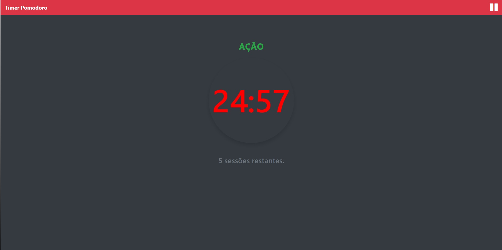

<h1 align="center"> Timer Pomodoro </h1>

Timer Pomodoro é um projeto desenvolvido para auxiliar na concetração de afazeres que requerem um foco maior para serem desempenhados.  

  <a href="#-tecnologias">Tecnologias</a>&nbsp;&nbsp;&nbsp;|&nbsp;&nbsp;&nbsp;
  <a href="#-projeto">Projeto</a>&nbsp;&nbsp;&nbsp;|&nbsp;&nbsp;&nbsp;
  <a href="#-layout">Layout</a>&nbsp;&nbsp;&nbsp;|&nbsp;&nbsp;&nbsp;
  <a href="#memo-licença">Licença</a>

  

 

  

## 🚀 Tecnologias

Esse projeto foi desenvolvido com as seguintes tecnologias:

- HTML e CSS
- JavaScript
- BootStrap
- Git e Github

## 💻 Projeto

O Timer Pomodoro é uma pagina que auxilia os usuários a focarem em seus afazeres utilizando o Método de Pomodoro.

- [Visite o projeto online](https://felipe-ago.github.io/timerpomodoro/)

## 📝 Licença

Esse projeto está sob a licença MIT.

---

Feito por Felipe Olivera com a tutoria de Thiago Lima da Thi Code 👋 [Acompanhe o trablho no Youtube!](https://www.youtube.com/@thicode.channel)
